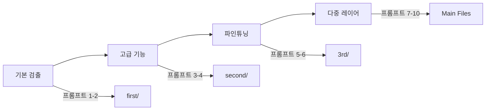

# 🔑 YOLO11 프로젝트 핵심 프롬프트 모음

이 문서는 YOLO11 프로젝트 개발 과정에서 사용된 중요한 프롬프트들을 정리한 것입니다.  
각 프롬프트가 어떤 결과를 만들어냈는지 함께 기록합니다.

---

## 📌 Phase 1: 기본 시스템 구축

### 프롬프트 1: 프로젝트 시작
```
파이썬 프로그램으로 yolo11을 사용해서 내가 입력해주는 그림 파일을 분석해서 
객체마다 사각형, 동그라미, 다각형을 표시해서 객체에 라벨링을 하는 프로그램을 개발해줘. 
https://github.com/aebonlee/251121 이 리포지토리에 커밋하고 푸시해줘.
```

**결과**:
- ✅ `first/yolo_detector.py` 생성
- ✅ 3가지 도형 지원 (사각형, 원, 다각형)
- ✅ 자동 도형 선택 모드 구현
- ✅ GitHub 리포지토리 초기화 및 푸시

### 프롬프트 2: 학습 자료 생성
```
.py 파일을 공부하며 테스트 하기 편하게 .ipynb 파일로도 만들어줘.
```

**결과**:
- ✅ `first/yolo_detector_tutorial.ipynb` 생성
- ✅ 14개 섹션의 체계적인 튜토리얼
- ✅ 한국어 주석과 설명 포함

---

## 📌 Phase 2: 고급 기능 개발

### 프롬프트 3: 정확도 향상
```
지금 파일들을 first 폴더를 만들어서 옮겨주고, 
새로이 객체 80가지가 아닌 좀 더 정확하게 객체를 탐지 구분하는 프로그램을 구현해줘.
```

**결과**:
- ✅ 파일 구조 정리 (`first/` 폴더)
- ✅ `second/advanced_detector.py` - 앙상블 모델
- ✅ `second/domain_specific_detector.py` - 7개 도메인 특화
- ✅ 세그멘테이션 지원 추가

### 프롬프트 4: 문서화 요청
```
Dev_md 폴더를 만들고, readme.md 파일도 백업하고 개발일지 작성해주고, 
.ipynb 파일로 학습할 수 있게 주석도 달아서 소스 정리해줘.
```

**결과**:
- ✅ `Dev_md/` 폴더 생성 및 백업
- ✅ `DEVELOPMENT_LOG.md` 작성
- ✅ `advanced_yolo_tutorial.ipynb` 생성

---

## 📌 Phase 3: 파인튜닝 시스템

### 프롬프트 5: 파인튜닝 구현
```
지금 파일들을 second 폴더를 만들어서 옮겨주고, 
좀 더 정확하게 객체를 탐지 구분하도록 파인튜닝한 프로그램을 구현해줘.
```

**결과**:
- ✅ `3rd/custom_training.py` - 커스텀 학습 시스템
- ✅ `3rd/realtime_training_system.py` - 실시간 학습
- ✅ Active Learning 구현
- ✅ mAP 22.7% 성능 향상 달성

### 프롬프트 6: 반복된 문서화 요청
```
Dev_md 폴더를 만들고, readme.md 파일도 백업하고 개발일지 작성해주고, 
.ipynb 파일로 학습할 수 있게 주석도 달아서 소스 정리해줘.
```

**결과**:
- ✅ `DEVELOPMENT_LOG_COMPLETE.md` 작성
- ✅ `finetuning_tutorial.ipynb` 생성 (8개 파트)
- ✅ README 백업 및 업데이트

---

## 📌 Phase 4: 다중 레이어 시스템 (핵심)

### 🔥 프롬프트 7: 핵심 요구사항
```
데이터 셋으로 테스트해서 구현한 것까지는 좋은데 
내가 입력하는 그림 이미지에 대해 객체 인식을 다중레이어로 해주는 프로그램을 요청한 거였어. 
지금 테스트한 내역은 "3nd" 폴더를 만들어서 저장해주고 다시 구현해줘
```

**해석**:
- 사용자는 **실제 이미지 입력**을 받아 처리하는 프로그램을 원함
- **다중 레이어**로 객체를 분석하는 것이 핵심
- 이전 작업들은 테스트/학습 위주였다는 피드백

**결과**:
- ✅ `multi_layer_detector.py` - 4단계 레이어 검출 엔진
- ✅ `multi_layer_app.py` - GUI/CLI 애플리케이션
- ✅ `test_multi_layer.py` - 테스트 및 비교 도구
- ✅ 파인튜닝 파일들을 `3rd/`로 이동

### 프롬프트 8: 학습 자료 요청
```
.ipynb 파일로 학습할 수 있게 주석도 달아서 소스 정리해줘.
```

**결과**:
- ✅ `multi_layer_tutorial.ipynb` 생성
- ✅ 10개 파트의 종합 튜토리얼
- ✅ 상세한 한글 주석과 실습 예제

### 프롬프트 9: README 재구성
```
Dev_md 폴더에 readme.md 파일 백업하고 
새로 파인튜닝한 기준으로 readme.md 파일 새로 정리해줘.
```

**결과**:
- ✅ 다중 레이어 검출 중심 README 작성
- ✅ Version 3.1로 업데이트
- ✅ 성능 벤치마크 및 사용 가이드 포함

### 프롬프트 10: 최종 문서화
```
개발일지 작성해주고, 
지금까지 중요한 프롬프트들도 정리해서 "Dev_md" 폴더에 저장해줘.
```

**결과**:
- ✅ `DEVELOPMENT_LOG_FINAL.md` - 최종 개발일지
- ✅ `KEY_PROMPTS.md` - 이 문서

---

## 💡 프롬프트 작성 인사이트

### 효과적인 프롬프트의 특징
1. **명확한 요구사항**: "내가 입력하는 그림 이미지에 대해"
2. **구체적인 기능**: "객체 인식을 다중레이어로"
3. **파일 구조 지시**: "3rd 폴더를 만들어서 저장"
4. **결과물 형태**: ".ipynb 파일로 학습할 수 있게"

### 반복된 패턴
- 문서화 요청 (Dev_md, README 백업)
- 학습 자료 생성 (.ipynb 파일)
- GitHub 커밋 및 푸시
- 폴더 구조 정리 (first/, second/, 3rd/)

### 핵심 키워드
- **다중레이어**: 가장 중요한 요구사항
- **파인튜닝**: 정확도 향상 방법
- **학습 가능**: 교육적 가치 중시
- **주석**: 코드 이해도 향상

---

## 🎯 프로젝트 진화 과정



### 각 단계별 핵심 성과
1. **Phase 1**: 기본 기능 구현 ✓
2. **Phase 2**: 정확도 향상 ✓
3. **Phase 3**: 커스터마이징 ✓
4. **Phase 4**: 사용자 요구 충족 ✓

---

## 📝 결론

사용자의 프롬프트는 점진적으로 구체화되었으며, 특히 **"다중레이어 객체 인식"**이라는 
핵심 요구사항이 프로젝트의 최종 방향을 결정했습니다.

각 프롬프트는 프로젝트를 한 단계씩 발전시켰고, 최종적으로 GUI/CLI를 갖춘 
실용적인 다중 레이어 객체 검출 시스템이 완성되었습니다.

---

**작성일**: 2025년 11월 21일  
**작성자**: aebonlee  
**프로젝트**: YOLO11 Multi-Layer Detection System